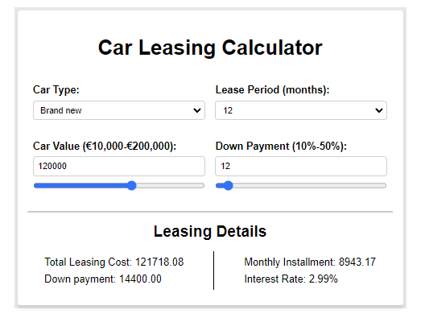

# Car_Leasing-Calculator
User-friendly calculator for estimating monthly leasing costs

## Description
This project is a web-based calculator designed to help users calculate leasing costs for new and used cars. It dynamically updates calculations based on user input for car value, lease period, and down payment. When a user enters car value/down payment value which is lower or higher than the allowed the calculator doesn't allow it as no change is displayed after typing.

## Features
- Responsive design for optimal viewing on all device sizes.
- Real-time calculation updates as input values change.
- Supports both new and used car leasing calculations.

## UI
- This is how the UI looks

## Technologies Used
- HTML
- CSS (stylesheets.css, calculator.css, inputs.css, outputs.css, responsive.css)
- JavaScript (script.js, calculations.js, inputsFunctionalities.js)

## Project Structure
- `index.html`: The main HTML document.
- `styles/`: Contains CSS files for styling.
- `stylesheets`: Imports all stylesheets and sets global rules for them
- `script.js`: Handles user input events.
- `calculations.js`: Performs the leasing calculations.
- `inputsFunctionalities.js`: Manages input validations and synchronizations.

## Setup and Installation
1. Clone the repository to your local machine.
2. Open `index.html` in your browser to view the project.

## Usage
To use the calculator, select the car type, enter the car value, choose the lease period, and specify the down payment. The calculator will display the total leasing cost, down payment, and monthly installment.

## License
This project is licensed under the MIT License - see the LICENSE file for details.

## Contact
For any questions or to report issues, please contact me at [georgi.ginduzov17d@.com].